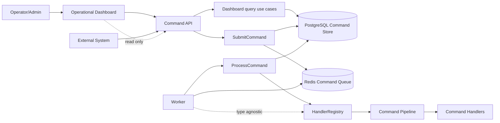

# Operational Command Dashboard

The operational dashboard is a read-only Vue 3 frontend for monitoring
persisted command processing data.

It is designed for operators and administrators who need to inspect command
volume, lifecycle status, callback outcomes, filtered command lists, and full
command details without changing system state.

## Scope

The dashboard only reads persisted data through the API. It does not:

- submit commands
- consume Redis queues
- process commands
- change command status
- modify PostgreSQL records
- execute or resend callbacks

## Runtime Services

Docker Compose runs the dashboard as a separate service:

```text
dashboard -> api -> postgres
```

The dashboard does not connect directly to PostgreSQL or Redis.



Local URLs:

```text
Dashboard:    http://localhost:5173/dashboard
API docs:     http://localhost:8000/docs
RedisInsight: http://localhost:5540
```

## API Contracts

The dashboard consumes these read-only endpoints:

```text
GET /dashboard/indicators
GET /dashboard/commands
GET /dashboard/commands/{command_id}
```

### Indicators

`GET /dashboard/indicators` returns command and callback counters:

```json
{
  "total_commands": 2,
  "queued_commands": 0,
  "processing_commands": 0,
  "completed_commands": 2,
  "failed_commands": 0,
  "callback_not_required": 2,
  "callback_pending": 0,
  "callback_sent": 0,
  "callback_failed": 0
}
```

### Command List

`GET /dashboard/commands` supports:

- `page`
- `page_size`
- `status`
- `type`
- `external_id`
- `callback_status`
- `received_from`
- `received_to`
- `processing_from`
- `processing_to`
- `search`
- `sort_by`
- `sort_direction`

Example:

```bash
curl -i "http://localhost:8000/dashboard/commands?status=completed&page=1&page_size=20&sort_by=request_received_at&sort_direction=desc"
```

### Command Detail

`GET /dashboard/commands/{command_id}` returns the complete persisted command
record, including:

- identifiers
- command status
- callback status
- original payload
- response payload
- processing error
- callback error
- lifecycle timestamps

## Frontend Structure

```text
dashboard/
├── src/
│   ├── components/dashboard/
│   ├── router/
│   ├── services/dashboardService.ts
│   ├── stores/dashboardStore.ts
│   ├── types/command.ts
│   └── views/DashboardView.vue
└── tests/
```

Responsibilities:

- `DashboardView.vue`: composes the dashboard screen and delegates state changes.
- `dashboardStore.ts`: owns indicators, list, filters, pagination, sorting,
  selected command, loading flags, and error state.
- `dashboardService.ts`: wraps read-only HTTP calls.
- `CommandsFilters.vue`: emits filter and search criteria.
- `CommandsTable.vue`: emits pagination, sorting, and detail selection events.
- `CommandDetailsDrawer.vue`: displays one full command record.
- `JsonViewer.vue`: formats payload and response JSON with expand/collapse.

## Local Development

```bash
cd dashboard
npm install
npm run dev
```

Open:

```text
http://localhost:5173/dashboard
```

In local Docker Compose, the dashboard uses:

```text
VITE_API_BASE_URL=/api
VITE_API_PROXY_TARGET=http://api:8000
```

The Vite proxy maps `/api/*` to the backend service and keeps `/dashboard`
available for Vue Router.

## Validation

Run frontend tests:

```bash
cd dashboard
npm test
```

Run frontend build:

```bash
cd dashboard
npm run build
```

Run backend regression tests:

```bash
.venv/bin/pytest
```

Run the full local stack:

```bash
docker compose up -d --build
docker compose ps
```

Smoke-test the dashboard API:

```bash
curl -s http://localhost:8000/dashboard/indicators
curl -s "http://localhost:8000/dashboard/commands?page=1&page_size=5"
```

## Acceptance Notes

The implementation was validated with:

- 21 dashboard tests passing
- dashboard production build passing
- 89 backend tests passing
- Docker Compose stack running with `api`, `worker`, `redis`, `postgres`,
  `redisinsight`, and `dashboard`
- browser verification showing indicators and command table data at
  `http://127.0.0.1:5173/dashboard`
